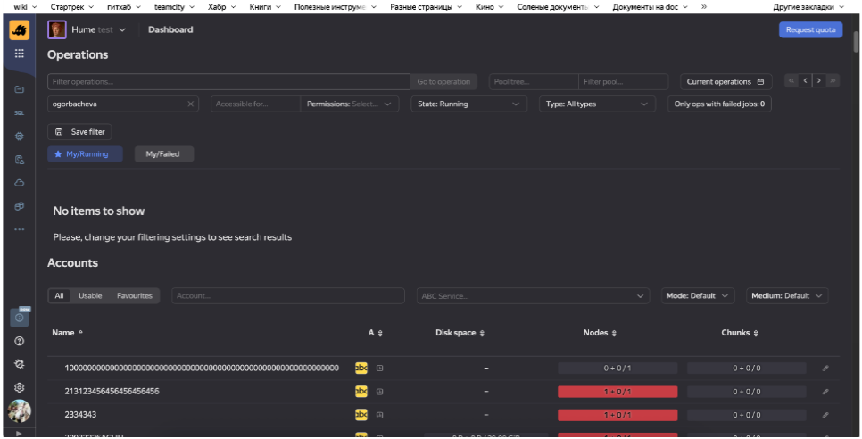
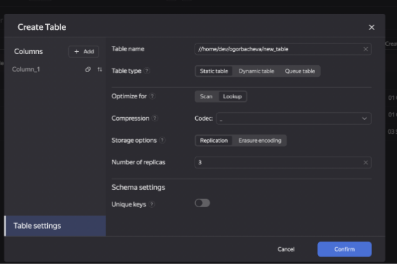
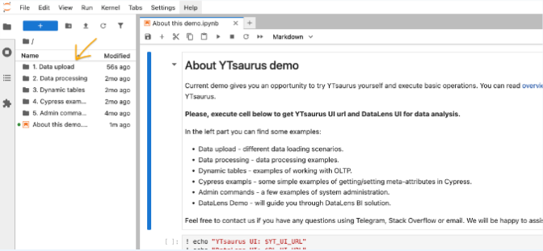
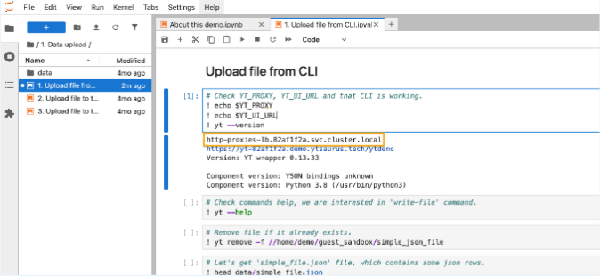

# Тестовое задание: Ревью черновика технической инструкции

**Источник:** Тестовое задание на позицию технического писателя  
**Продукт:** YTsaurus (YT) — платформа для работы с большими данными  
**Дата выполнения:** 2025

## Постановка задачи

Представьте, что вы уже работаете в нашей команде и коллега-разработчик 
принёс вам на ревью черновик своей статьи. Это инструкция, которая должна 
помогать **разработчикам и аналитикам** работать со статическими таблицами 
в продукте YT.

**Ваша задача:** проанализировать инструкцию на предмет слабых мест и 
дать конструктивную критику.

## Рекомендации по оформлению ответа

Оформите свои замечания в виде таблицы со столбцами:

1.  **Краткое описание проблемы** — что именно в инструкции не так.
2.  **Фрагмент из текста** — где встретилась проблема.
3.  **Пояснение** — почему это нужно поправить. Если в каких-то местах требуются уточнения у разработчика, зафиксируйте здесь эти вопросы.

**Ключевые принципы:**
- **Баланс:** фокусируйтесь на ключевых слабых местах, чтобы список был информативным, но не углубляйтесь в мелкие детали.
- **Творческий подход:** мы ожидаем не просто поиск опечаток, а глубокий анализ текста с акцентом на улучшение **структуры, содержания и стиля**.
- **Критика, а не переписывание:** ваша задача — оценить статью и дать конструктивную критику, а не переделывать всю работу за коллегой.

---

## Черновик инструкции для анализа

Ниже представлен исходный текст черновика статьи, которую необходимо проанализировать.

### Подробная инструкция по статическим таблицам в платформе хранения и обработки большого объёма данных YT

YT — это платформа распределённого хранения и обработки больших объёмов данных, 
в которую встроены: поддержка MapReduce, распределённая файловая система 
(называется Кипарис), key-value хранилище, шедулер операций, и всё это вместе 
составляет комплексную систему, аналогичную широко известному Apache Hadoop. 
В этом руководстве речь пойдёт про одну из самых базовых функциональностей 
в системе YT — статические таблицы. Без статических таблиц не обходится ни один 
ETL-процесс, а также невозможна batch-обработка данных, что в свою очередь, 
является неотъемлемой частью Big Data платформ.

Преимушества статичных таблиц в YT-платформе, которые делают их по-настоящему 
незаменимыми в контексте сложных распределённых вычислительных парадигм, 
заключаются в следующем. Во-первых, они обеспечивают высокую производительность 
для чтения и записи больших объёмов. Во-вторых, они позволяют эффективно 
масштабировать данные за счёт встроенных механизмов распределения, которые 
адаптируются к растущим объёмам без потери целостности. В-третьих, обеспечивают 
надёжность хранения, так как системой поддерживается репликация чанков. 
Кроме того, таблицы могут быть несортированными или сортированными по ключевым
столбцам.

В руководстве вам будет предложены примеры, которые демонстрируют работу 
со статическими таблицами: в веб-интерфейсе YT и через утилиту CLI. Для 
работы с примерами вам понадобится:

1. Браузер.
2. Командная строка shell.
3. Доступ к кластеру YTsaurus.
4. Хорошее настроение.

#### Как получить доступ к кластеру YT

Самый быстрый способ начать работать с YT кластером — на демо-стенде. 
Доступ к нему может получить любой желающий, [заполнив форму](https://ytsaurus.tech/#demo). 
После того как вы заполните форму, на указанную вами почту придёт письмо — 
в нём будут данные для подключения. Вам понадобится **Ссылка на YTsaurus** 
— это ссылка на веб-интерфейс системы.

#### Как работать со статическими таблицами YT через веб-интерфейс

Самый удобный способ работать с таблицами — через YT UI. Там вы сможете, 
например, создавать и удалять таблицы, а также загружать в них данные из 
других систем (например, из Excel). Чтобы создать статическую таблицу:

1. Откройте веб-интерфейс YT по ссылке из письма. Пример веб-интерфейса представлен ниже на скриншоте.  

2. В UI зайдите в свой домашний каталог;
3. Нажмите кнопку Create object и выберите "Table". Появится всплывающее окно с формой для создания таблицы;  

4. Заполните поля формы:
    *   **Table name** — это путь и название вашей таблицы.
    *   **Table type** — выберите Static.
    *   **Optimize for** — для каких типов запросов нужна оптимизация: скан или лукап запросов.
    *   **Compression** — кодек для сжатия чанков. Внимательно отнеситесь к выбору кодека — это повлияет на производительность работы с таблицей.
5. Нажмите кнопку Confirm.

Готово — таблица создана. Теперь, чтобы записать в неё данные, откройте 
эту таблицу, нажмите кнопку **YQL Kit**. Во всплывающем окне введите INSERT-запрос. 
Про синтаксис читайте в разделе [INSERT INTO](https://ytsaurus.tech/docs/ru/yql/syntax/insert_into).

Кроме создания таблицы, прямо из веб-интерфейса вы сможете её изменить 
(например, поменять название, или выставить на ней пользовательский атрибут) 
и удалить. Чтобы узнать, как это сделать, мы предлагаем вам самостоятельно 
поисследовать веб-интерфейс.

#### Статические таблицы в утилите CLI

Сначала установите утилиту `ytsaurus-client` командой:

```bash
pip3 install ytsaurus-client
```

**Примечание:** Не забудьте добавить путь до `$HOME/.local/bin` в переменную `PATH`.

**Обратите внимание:** для работы с утилитой у вас в системе должна быть 
питонячая версия 3.8+.

Далее установите переменную окружения `YT_PROXY` — это нужно для доступа к 
кластеру YT из консоли. В качестве её значения укажите адрес кластера Ытя:

```bash
export YT_PROXY=<cluster_url>
```
> [!] **Как узнать адрес кластера**
> 1. В письме, которое вы получили после заполнения формы, перейдите по первой ссылке (**Ссылка на Jupyter**). Откроется Jupyter-ноутбук с доступом к кластеру YT. 
> 2. В открывшемся ноутбуке двойным кликом перейдите в папку с каким-нибудь примером, например **Data upload 1.**  
> 
> 3. Затем откройте самый первый пример и запустите первую ячейку. В выводе появится ссылка на YT-прокси. Подставьте это значение вместо `<cluster-url>`.  
> 

Также доступа к системе нужно указать токен. Для этого нужно задать переменную 
`YT_TOKEN` со значением `password`. Для доступа к демо-кластеру по умолчанию 
используется этот пароль.

```bash
export YT_TOKEN=password
```

> [!Примечание]
> Здесь токен задаётся в переменной окружения — это сделано намеренно, для простоты 
> и наглядности примера. В реальных задачах так делать **строго не рекомендуется**.

Всё готово — мы настроили систему и теперь создадим статическую таблицу:

```bash
$ yt create table //home/input_table --attributes '{schema = [{name = id; type = int64}; {name = text; type = string}]}'
> 16-64ca-10191-47007b7d
```

**Примечание:** Значение `16-64ca-10191-47007b7d` — это идентификатор созданного 
узла Кипариса.

Теперь запишите данные в таблицу вызвав команду `write-table`. Подробнее про неё 
читайте в соответствующей документации.

    [!Примечание]
    Дописывать данные в таблицу можно только путём append или через операции вроде MapReduce, Merge или Concatenate.

Чтобы убедиться, что данные записались в таблицу, выполните команду 
`yt read-table //home/input_table`. Не забудьте передать аргумент `--format json`.
