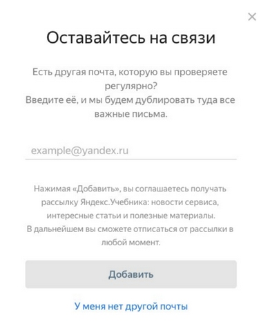

# Тестовое задание: Редизайн текста интерфейса Яндекс.Учебника

**Источник:** Тестовое задание на позицию UX-писателя / контент-дизайнера  
**Продукт:** Яндекс.Учебник  
**Дата выполнения:** 2025

## Контекст задачи

Пользователи образовательной платформы часто не проверяют почту, 
привязанную к аккаунту (используют её только для регистрации). 
Из-за этого они пропускают важные уведомления.

**Задача сервиса:** предложить пользователям получать рассылку на другой, 
более активный email-адрес.

## Исходный материал

Оригинальный интерфейс содержит следующий текст:
> 
> **Заголовок:** Оставайтесь на связи
> 
> **Основной текст:** Добавьте еще один адрес электронной почты, на который будут дублироваться важные письма от Яндекс.Учебника.
> 
> **Кнопка:** Добавить
> 
> **Ссылка отказа:** У меня нет другой почты

### Изображение оригинального интерфейса

## Требования к решению

1. **Проанализировать недочеты** текущего варианта текста
2. **Предложить улучшенную версию** интерфейса
3. **Обосновать изменения** с точки зрения UX и психологии пользователя
4. **Учесть бизнес-задачи:**
   - Увеличить конверсию на добавление email
   - Разделить важные уведомления и новостную рассылку
   - Сохранить доверие пользователей

## Критерии оценки

- **Ясность** — пользователь понимает, зачем добавлять почту
- **Убедительность** — текст мотивирует к действию
- **Тональность** — соответствует дружелюбному образовательному продукту
- **Честность** — прозрачные условия подписки
- **Эффективность** — решает проблему пропуска уведомлений

---

*Это задание демонстрирует навыки UX-письма и анализа пользовательских сценариев.  
Полное решение представлено в файле [`solution.md`](./solution.md).*